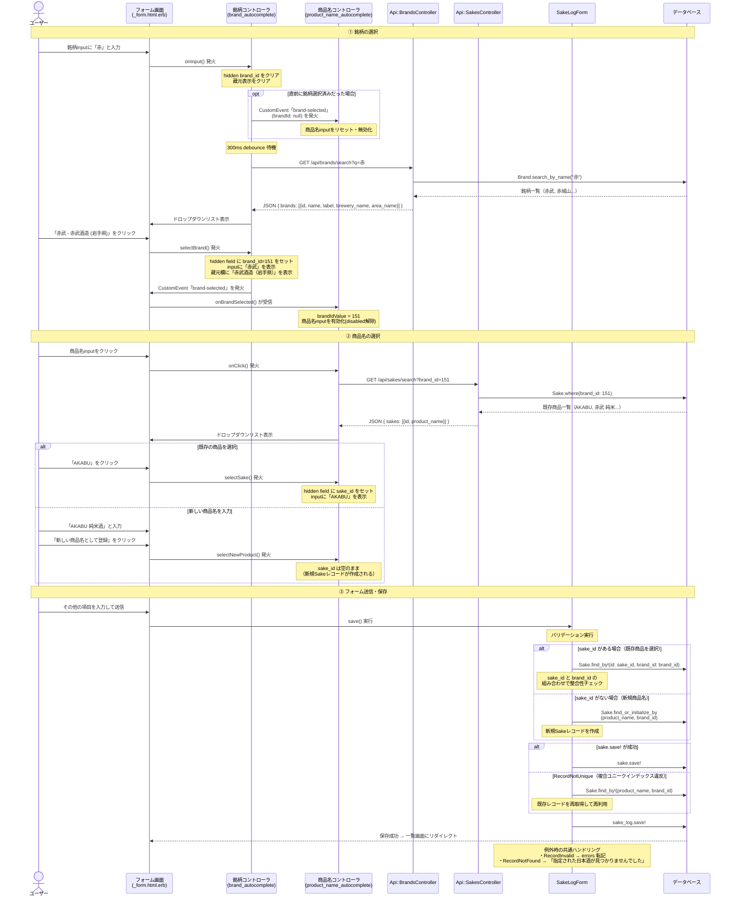
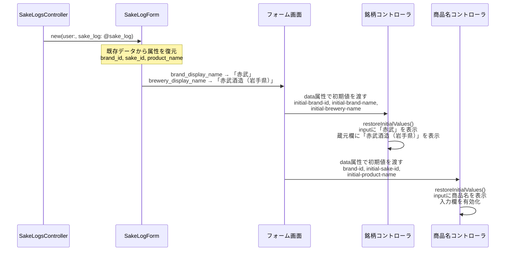
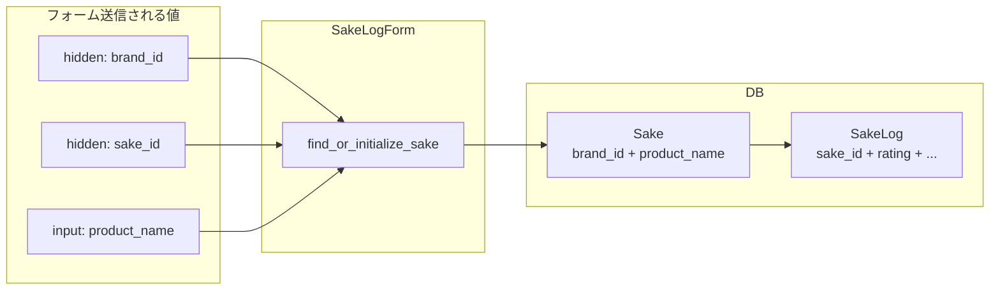

# **4/12(日)**
## 【学習時間】
5.2h(累計:1,314h/1,000h)  

## 【学習内容】
- アプリ開発

___
## 卒制概要
日本酒の記録アプリ。
## 【やったこと】
- [issue さけのわAPIマスタテーブル以外の銘柄・蔵元の登録機能](https://github.com/Hiruyan-J/GinLog/issues/222)対応
  
## 【学んだこと】（知識・タスク分解などの振り返り）  
### 可逆的なマイグレーションファイル
- 不可逆的なマイグレーションファイルだと、railsがうまくロールバックできない場合がある。
    - 例) 通常のマイグレーションファイル        
        ```ruby
        class マイグレーション名 < ActiveRecord::Migration[7.2]
          def change
            # text型からstring型へ変更
            change_column :hoges, :comment, :string
          end
        end
        ```        
        上記のコードは、正常に実行される。一方、ロールバックする前は、text型であったという情報がない。        
        その為、ロールバックを行うとrailsが「何型に戻せば良いか」が分からず、例外が発生してしまう。
        
- upメソッド・downメソッドを明示すると、可逆的なマイグレーションファイルとなる
    - マイグレーション実行時：upメソッド実行
    - ロールバック時：downメソッド実行
    - 例) 可逆的なマイグレーションファイル        
        ```ruby
        class マイグレーション名 < ActiveRecord::Migration[7.2]
          def up
            # text型からstring型へ変更
            change_column :hoges, :comment, :string
          end
          
          def down
            # string型からtext型へ戻す
            change_column :hoges, :comment, :text
          end
        end
        ```        
- 参考
	- [[Railsガイド] up-downメソッドを使う](https://railsguides.jp/v7.2/active_record_migrations.html#up-down%E3%83%A1%E3%82%BD%E3%83%83%E3%83%89%E3%82%92%E4%BD%BF%E3%81%86)
	- https://pikawaka.com/rails/migration#%E5%8F%AF%E9%80%86%E7%9A%84%E3%81%AA%E3%83%9E%E3%82%A4%E3%82%B0%E3%83%AC%E3%83%BC%E3%82%B7%E3%83%A7%E3%83%B3%E3%83%95%E3%82%A1%E3%82%A4%E3%83%AB%E3%82%92%E4%BD%9C%E6%88%90%E3%81%97%E3%82%88%E3%81%86

### マイグレーションでは ActiveRecordモデルを使わず生SQLを使う
- 学んだこと
	マイグレーション内で既存データを確認・操作する場合、 `Sake.where(...).count` のようにActiveRecordモデルを直接呼び出すのは避け、 `connection.select_value` 等で生SQLを発行する方が安全。

- Before / After
	db/migrate/○○_change_brand_id_not_null_on_sakes.rbファイル	
	```ruby
	# Before: ActiveRecord モデルに依存
	null_count = Sake.where(brand_id: nil).count
	
	# After: 生 SQL で直接テーブルを参照
	null_count = connection.select_value(
	  "SELECT COUNT(*) FROM sakes WHERE brand_id IS NULL"
	).to_i
	```
- なぜ生SQLの方が良いのか
	1. モデルの将来変更に影響を受けない	    
	    マイグレーションは「そのマイグレーションが書かれた時点の状態」を保つべきもの。	    
	    一方、Sakeモデルを直接使うと、**将来のモデル変更の影響をうけてしまう。**	    
	    例:	    
	    - `default_scope { where(deleted_at: nil) }`が後から追加されると、 `Sake.where(brand_id: nil).count`は、論理削除されたレコードをカウントしなくなる。
	    - `Sake`モデルが `SakeProduct`モデルにリネームされた場合、 `rails db:migrate` を最初から実行するとエラーが発生する。
	2. 古いマイグレーションを再実行しても安定する	    
	    新しい開発者が `rails db:migration:reset`やリセット後の再構築をした場合、当時のモデル定義はもう存在しない。モデル依存だとエラーや想定外動作の原因となる。    

- connection のメソッド一覧
	`ActiveRecord::Migration` 内では `connection` で DB コネクションにアクセスできる。

| メソッド | 返り値 | 用途 |
| --- | --- | --- |
| `select_value(sql)` | 1 行 1 列の値 | COUNT, MAX などスカラー取得 |
| `select_values(sql)` | 1 列の配列 | ID 一覧などの取得 |
| `select_one(sql)` | 1 行 (Hash) | 1 レコードの複数カラム取得 |
| `select_all(sql)` | **`ActiveRecord::Result`** | 複数レコード取得 |
	- https://api.rubyonrails.org/v7.2.3/classes/ActiveRecord/ConnectionAdapters/DatabaseStatements.html#method-i-select_all

### オートコンプリートでの入力補佐
今回の実装ではないですが、銘柄・商品名をオートコンプリートで入力できるようにしました。
- 銘柄のオートコンプリート
	[](https://gyazo.com/abce64f5c3d7cfccef8aa2d921dc9d41)
- 商品名のオートコンプリート
	[](https://gyazo.com/934c9988aa70238fe912abfe2a149d85)
- 商品名の新規登録
	[](https://gyazo.com/107e9565248a7d1048fb78456b52673e)
- 新規記録時の処理フロー



- 編集時の初期値復元フロー



- データの流れまとめ



- ドロップダウンリスト表示がAPI経由でDBを検索している理由

```markdown
┌─────────────────────┐         ┌─────────────────────┐
│  ユーザーのブラウザ   │         │      サーバー       │
│                     │         │                     │
│  brand_autocomplete │  HTTP   │  Api::Brands        │
│  _controller.js     │ ──────→ │  Controller         │
│                     │  JSON   │       ↓             │
│  ドロップダウン描画   │ ←────── │  Brand.search_by... │
│                     │         │       ↓             │
│                     │         │     PostgreSQL      │
└─────────────────────┘         └─────────────────────┘
    ユーザーの PC               Docker コンテナ(サーバー)
```

- ドロップダウンリストの描画をしているJavaSqriptは、ユーザーのPCで動くため、API経由でDBを検索する必要がある
    - **JavaScript**（Stimulus コントローラ）はユーザーのブラウザ上で動く
    - **データベース**（PostgreSQL）はサーバー上で動く
- ブラウザから直接データベースに接続させると、**DB のパスワードやデータが丸見え**になってしまう。(ブラウザの開発者ツールで誰でも確認できてしまうため)

- ポイント

- ユーザーが直接入力するのは「銘柄名」と「商品名」のテキストのみ
- `brand_id` と `sake_id` は hidden field で裏側でセットされる
- 2つの Stimulus コントローラ間は `CustomEvent("brand-selected")` で連携
  
## 【今後の予定】
- [issue さけのわAPIマスタテーブル以外の銘柄・蔵元の登録機能](https://github.com/Hiruyan-J/GinLog/issues/222)対応続き

___
オートコンプリートで入力しやすいようにしたり、不用意にレコードが複数作成されないような機能を実装しました！
課題としては、ユーザーが銘柄の選択に迷いそうという所です。
蔵元を先に選択し、銘柄欄をアクティブにするとその酒蔵の銘柄一覧がオートコンプリートで表示されるようにした方がユーザーが迷わなくて良いかな🤔
一方で、記入の手数が増えてしまう、、、
UI/UX面は今後、再考の余地がありそうですね🍶


# **4/19(日)**
## 【学習時間】
7.5h(累計:1332.2h/1,000h)

## 【学習内容】
- アプリ開発
___
#ひるやんの卒制記録
https://github.com/Hiruyan-J/GinLog
## 卒制概要
日本酒の記録アプリ。
## 【やったこと】
- [さけのわAPIマスタテーブル以外の銘柄・蔵元の登録機能](https://github.com/Hiruyan-J/GinLog/issues/222)対応
	- FormObject実装
	- view実装
	- stimulus実装中  


## 【学んだこと】（知識・タスク分解などの振り返り）  

### バリデーションの`if:`オプション	
  - `if:` オプション
      - バリデーションを実行するかどうかを決定するために呼び出すメソッド
  - **`if:` に渡せる形式**
      - シンボル → インスタンスメソッドを呼ぶ
        ```ruby
        validates :name, presence: true, if: :manual_mode?
        ```
        - Proc / lambda → その場で条件を書く
            ```ruby
            validates :name, presence: true, if: -> { manual_mode? && some_other_condition }
            ```
  - 備考
      - 逆条件は `unless:` オプション
          ```ruby
          validates :brand_id, presence: true, unless: :manual_mode?
          ```

  - 参考
    - [Railsガイド - Active Model の基礎](https://railsguides.jp/v7.2/active_model_basics.html#validations%E3%83%A2%E3%82%B8%E3%83%A5%E3%83%BC%E3%83%AB)

### predicate メソッドについて
- **predicate メソッドとは**
    - Ruby で「真偽値を返すメソッド」の慣習的な命名スタイル
    - メソッド名の末尾に `?` を付ける（例: `active?`、`empty?`、`valid?`）
    - 呼び出し側で「〜かどうか」という問いとして自然に読める
    
- **Ruby/Rails での boolean 命名慣習**
    
    - **`is_` プレフィックスは付けない**（Java/JavaScript の慣習とは異なる）
    - ❌ `is_active`、`is_manual_mode`
        - ⭕ `active`、`manual_mode`
- 理由: Rails が boolean カラムに対して自動で `?` 付きメソッドを生成するため、`is_` は冗長
    
- **ActiveRecord と ActiveModel::Attributes の違い**

|  | boolean の `?` メソッド | **型キャスト（入力値 → boolean への変換）** |
| --- | --- | --- |
| ActiveRecord の boolean カラム | 自動生成される | 自動 |
| ActiveModel::Attributes の `:boolean` 属性 | **自動生成されない** | 自動 |

→ Form Object 等で ActiveModel::Attributes を使う場合、predicate メソッドは手動で定義する必要がある

- シンプルな predicate メソッドの書き方
    ```ruby
    attribute :manual_mode, :boolean
        
    # nil を false に正規化する書き方
    def manual_mode?
        manual_mode == true
    end
    ```

- `== true` を付ける理由
    - `attribute :xxx, :boolean` は `true` / `false` / **`nil`** の3値を返す（未設定時は nil）
        - `== true` で比較することで、nil を false に正規化して `true` / `false` のみを返せる

- **predicate メソッドを定義するメリット**

    1. **nil の正規化**: 予期せぬ nil による分岐ミスを防げる
    2. **Rails 慣習との整合性**: ActiveRecord と同じインターフェースを提供できる
    3. **将来の拡張点**: 判定ロジックが複雑化しても、呼び出し側を変更せず中身だけ変えられる
    4. **可読性**: `if: :manual_mode?` のようにバリデーションや分岐で意図が読み取りやすい

## 【今後の予定】
- メール送信機能の実装
- _form.html.erbのリファクタリングもしたい。。。
___
formObjectを使用して実装しているため、ApplicationControllerが自動でよしなにやってくれることを自分で実装しないといけないのがちらほら出てきます。
「Railsの裏側ではこれを自動でやってくれているんだな」と勉強になります。